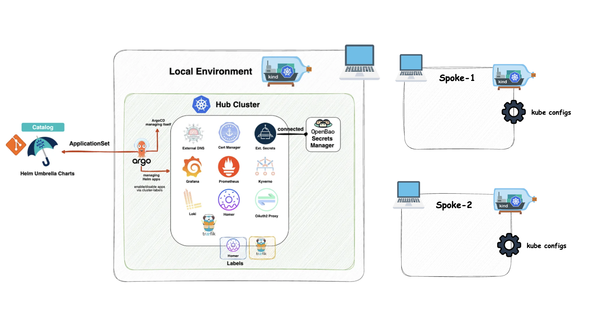
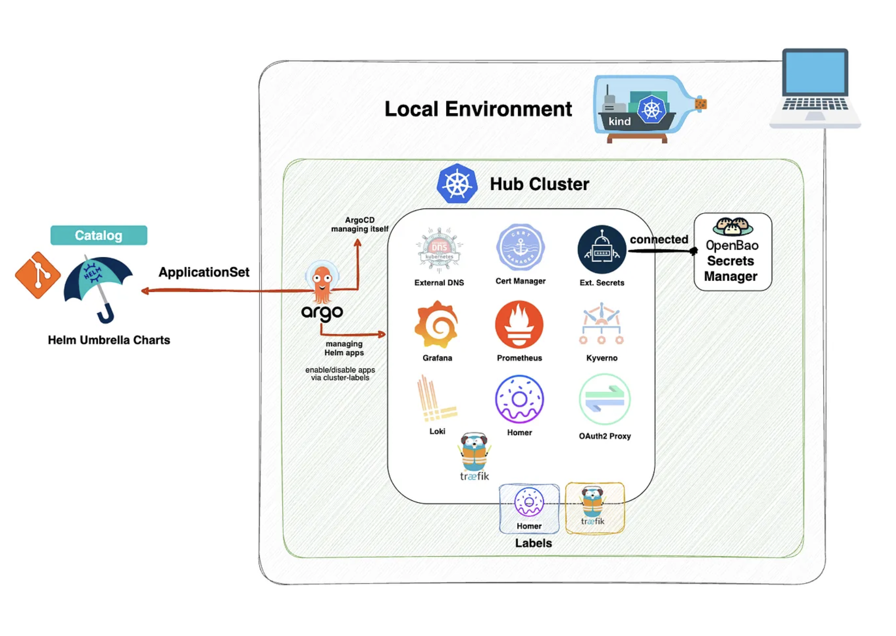
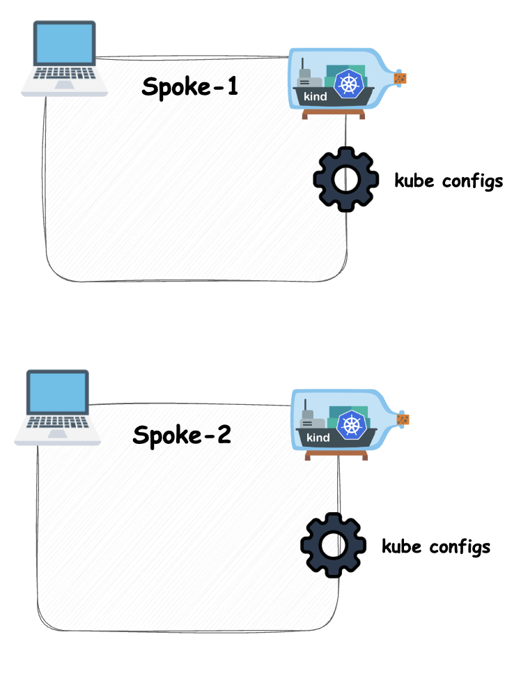
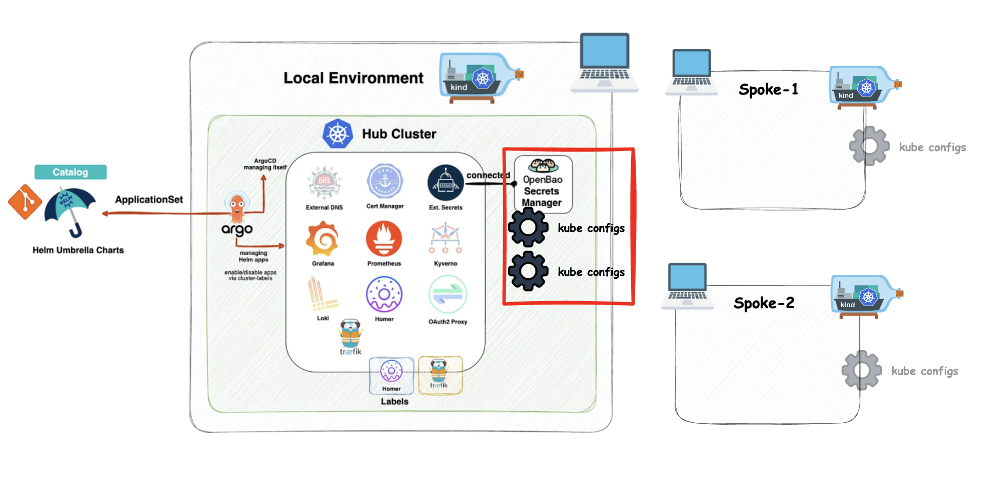
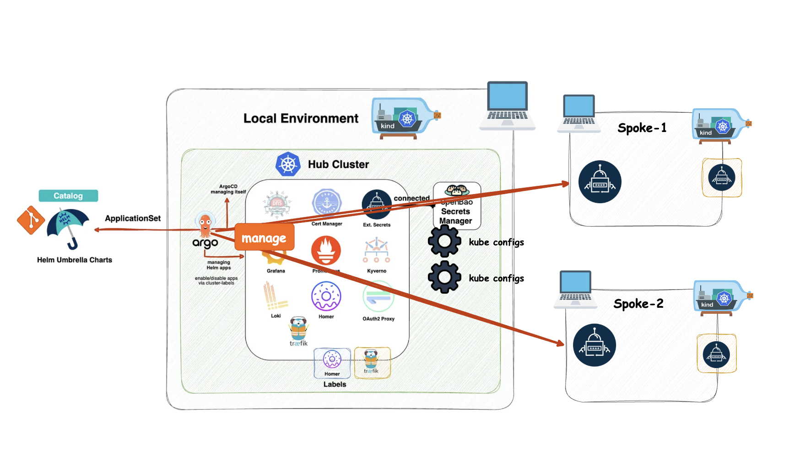

# kubara kind demo - hub and two spokes - Deep Dive



This setup creates two local kind clusters as spokes. The separately managed
`hub` remains the hub and is not created or deleted by these targets.

## Prerequisites

- Docker, OrbStack, Colima, or another container runtime
- `kind`
- `kubectl`
- [`cloud-provider-kind`](https://github.com/kubernetes-sigs/cloud-provider-kind),
  running in a separate terminal to provide a local cloud provider for the
  spoke clusters
- A running hub with Argo CD in the `argocd` namespace
- The hub kubeconfig at `.local/kind.kubeconfig`; override it with
  `HUB_KUBECONFIG=...` if necessary

## Bootstrap the local kubara development platform - Part 1

Install the kubara CLI.

```sh
brew tap kubara-io/tap
brew trust kubara-io/tap
# Trust this tap so Homebrew will be able to install and update kubara (required since Homebrew 6.0 for third-party taps).
# See: https://docs.brew.sh/Tap-Trust
brew install kubara
kubara --help
```

Bootstrap the local development platform.

```sh
kubara init --prep --local
# Edit .env.
kubara init --local --renovate=false
kubara bootstrap hub --local
```



## Start the spoke clusters - Part 2

Spin up two local kind clusters as spokes.

```sh
make -C z-demo-setup kind-up
make -C z-demo-setup kind-status
```



## Publish kubeconfigs to OpenBao - Part 3

Publish the spoke kubeconfigs to OpenBao as secrets for Argo CD to consume via
External Secrets.

```sh
make -C z-demo-setup openbao-secrets
```



## Connect to the spokes - Part 4

Manage the clusters with the kubara CLI using commands such as:

```sh
kubara cluster list
kubara cluster add
```

This creates a list entry in `config.yaml` and adds values to the Argo CD hub
configuration.

Generate the overlays configuration for the spokes and apply it to the hub.

```sh
kubara generate --helm
```



### Explain Catalog!!

## Clean up - Part 5

```sh
make -C z-demo-setup kind-down

kind delete cluster --name hub
```

Stop the `sudo cloud-provider-kind` process with `Ctrl+C` to release its
resources.

## Additional information

This section covers Parts 2 and 4 and explains what happens under the hood.

### kind cluster kubeconfigs

```sh
make -C z-demo-setup kind-up
make -C z-demo-setup kind-status
```

The Kubernetes APIs are available from the host at stable endpoints:

- `kubara-spoke-1`: `https://127.0.0.1:16443`
- `kubara-spoke-2`: `https://127.0.0.1:26443`

Host and internal kubeconfigs are written to `.local/kind-demo/`. The internal
variants use `https://<cluster>-control-plane:6443`, which Argo CD can reach
from the hub through the shared kind Docker network.

After `make -C z-demo-setup kind-up`, the hub and both host-accessible spoke
kubeconfigs are merged into the default `~/.kube/config`. Existing unrelated
contexts are retained, and `kind-hub` becomes the active context. Override the
output path or hub context with `MERGED_KUBECONFIG=...` or `HUB_CONTEXT=...`.

Use an individual host kubeconfig as follows:

```sh
kubectl --kubeconfig .local/kind-demo/kubara-spoke-1.kubeconfig get nodes
```

Use the merged default kubeconfig to switch between all clusters:

```sh
kubectl config get-contexts
kubectl config use-context kind-kubara-spoke-1
kubectl config use-context kind-hub
```

### OpenBao

```sh
make -C z-demo-setup openbao-secrets
```

The target discovers the OpenBao ingress through the hub, reads the local
bootstrap root token from `openbao-0`, and publishes both internal kubeconfigs
as KV v2 secrets:

- `kv/hub/local/argocd/kubara-spoke-1-dev`
- `kv/hub/local/argocd/kubara-spoke-2-prod`

Each secret contains a `kubeconfig` field. kubara creates an `ExternalSecret`
for each spoke, which subsequently creates the Argo CD cluster secret. The
clusters are not registered through the Argo CD CLI.

Spoke stages are read from `config.yaml` when present and otherwise fall back
to the values in `z-demo-setup/config/kind-demo.yaml` for this local demo.

Override the hub configuration when required:

```sh
make -C z-demo-setup openbao-secrets \
  HUB_KUBECONFIG=/path/to/hub.kubeconfig \
  PLATFORM_CONFIG=/path/to/config.yaml
```

The stored kind kubeconfigs contain client certificates with cluster-admin
permissions. They are intended only for this local demo setup.

### Additional targets

```sh
make -C z-demo-setup kind-plan       # Print the planned kind commands
make -C z-demo-setup kind-recreate   # Recreate both spokes
make -C z-demo-setup help
```

## Who is Johnny?


