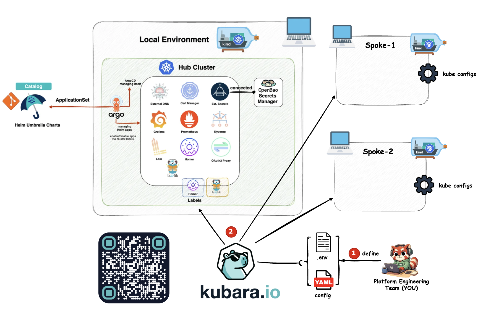

# kubara kind demo – hub and two spokes

Welcome to the kubara demo for ContainerDays Hamburg 2026. You can find detailed instructions for recreating the demo in the [deep dive](Deep-Dive.md).

## Bootstrap a local development platform with kubara and kind




Bootstrap the local development platform with just a few commands.

```sh
kubara init --prep --local
# Edit .env.
kubara init --local --renovate=false
kubara bootstrap hub --local
```

## Connect to the spokes

Manage the clusters with the kubara CLI using commands such as:

```sh
kubara cluster list
kubara cluster add
```

This creates a list entry in `config.yaml` and adds values to the Argo CD hub
configuration.

Generate the overlay configuration for the spokes and apply it to the hub.

```sh
kubara generate --helm
```


## Who is Johnny?


*The challenge starts with the [bootstrap sequence](https://docs.kubara.io/latest-stable/3_infrastructure/kind/#bootstrap-sequence).*
